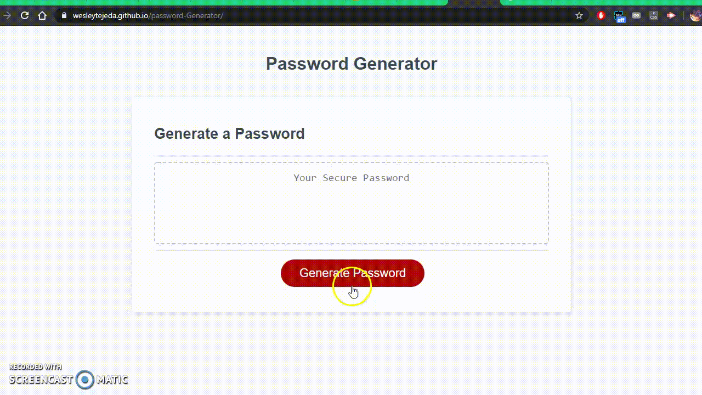

# password-Generator
By: ```Wesley Tejeda```

Deployed link: [https://wesleytejeda.github.io/password-Generator]

My GitHub : [https://github.com/wesleytejeda]
## General:
In this repository I've created a password generator that constructs a password to a length and character types specified by the user.

### Preview
Quick demo down below:


## My Approach in Detail:
In order to generate the password the user will first be prompted to give details about the parameters for their password such as password length and character types. This generator can produce a password of 8 to 128 characters in length. The types of characters are lowercase letters, uppercase letters, numbers, and special characters (check code snippet below for character possibilities).
```
var lowerCaseAlpha="abcdefghijklmnopqrstuvwxyz";
var upperCaseAlpha="ABCDEFGHIJKLMNOPQRSTUVWXYZ";
var numbers="0123456789";
var specialChar="@%+\\/\'!#$^?:,)(}{][~-_.";
```
I decided to use a function for input to save redundant lines of code. The function ```userChoice()``` defined on line 66 returns the values of true or false and saves the response in lines 37 through 40 in the generatePassword function.

So now that we have the parameters of our password we can move onto generating. I used a for loop that loops passLength times (the number between 8-128 that user first inputted), and our tempPass (variable that will be returned as a multi-character string) will be built one character at a time. tempPass adds itself (intially empty) with the function getChar that returns a single character. The function getChar relies upon a while loop and a random integer with values of 0-3 and also uses 4 if and else statements with conditions that reflect the users choices. If the random integer is 1 and the user chose lowercase letters then a lowercase character will return. However if the user didn't want lowercase characters then the while loop will reset and generate a new number until the type of character the user chose is selected and returned.

The final result will be a string with the length and types the user provided. This password gets returned to our writePassword function which in turn displays it to the read-only textbox.

## User Friendly Features
I wanted to incorporate a few fail-safes in my code where the script ends all further input requests and the textbox where the password is displayed stays default.

My first exit is if a user inputs a length not supported. This is in the function ```generatePassword()``` on line 23 of the javascript file.
```
if(passLength > 128 || passLength < 8){
    alert("Sorry, please choose between 8 and 128 characters. Click generate again.");
    return false;
  }
```
The ```generatePassword()``` function returns a password to the textbox and if this value is false then the code to overwrite the textbox is not executed. In my ```writePassword()``` function you can see that if ```generatePassword()``` returns false, the textbox is unaffected.
```
function writePassword() {
  var password = generatePassword();
  //Won't run the next lines in function to avoid textbox change if exit
  if(password !== false){
  var passwordText = document.querySelector("#password");
  passwordText.value = password;
  }
}
```

Another exit point is on line 43 which is after the user inputs the types of characters they would like. If they chose none of the types (either deliberately or by misclicks), the user will get a display explaining that the password will not be generated. The user can either decide to stay in the while loop and choose what types to include again with the same length specified or simply choose to exit out of the password generation process.
```
else {
      var stayInLoop= confirm("Sorry we cannot make a password without any character types.
      Please choose at least one character type.
      Would you like to run this one more time with
      the same length provided?");
      if(stayInLoop === false){
      alert("You've decided to exit. No further input required.");
      run = false;
      return false;
      }
    }
```

You can try this password generator for yourself at [https://wesleytejeda.github.io/password-Generator]
